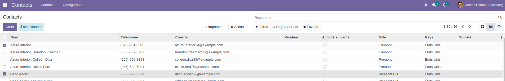
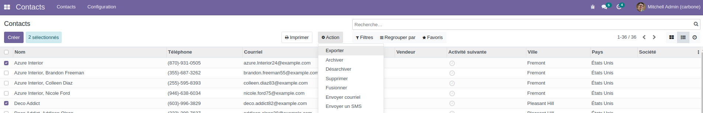
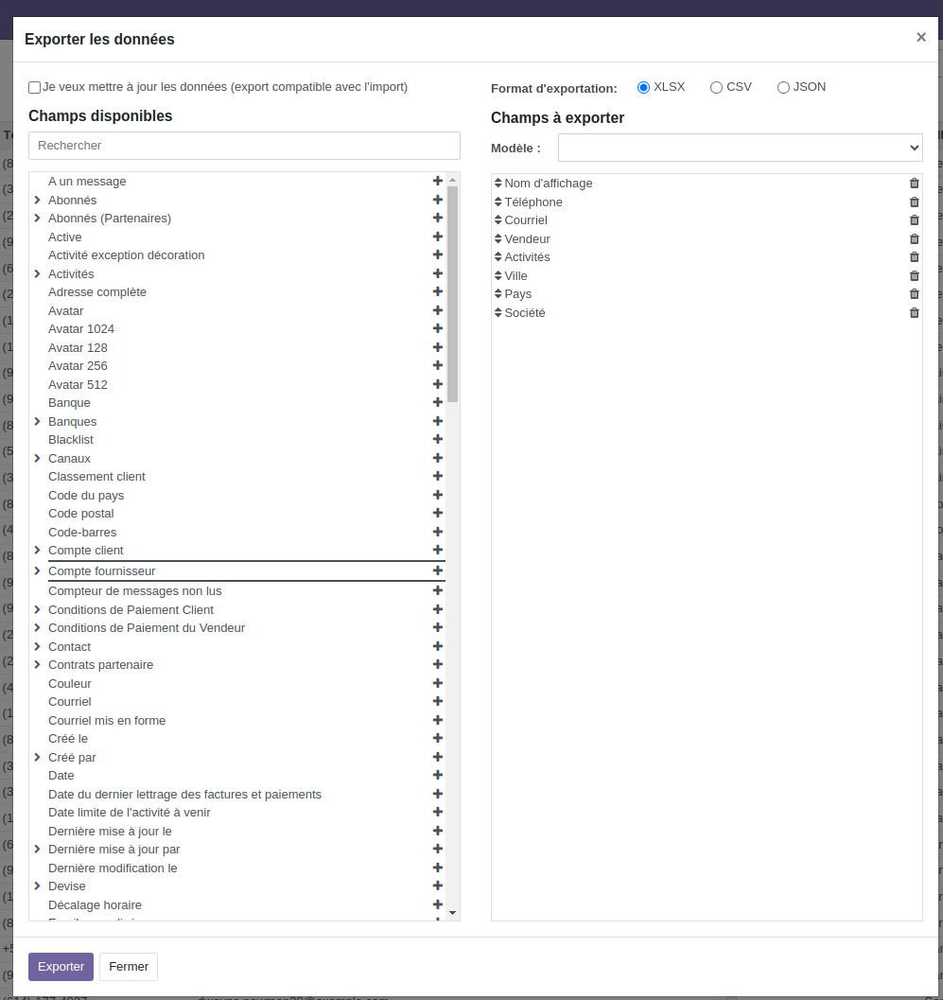
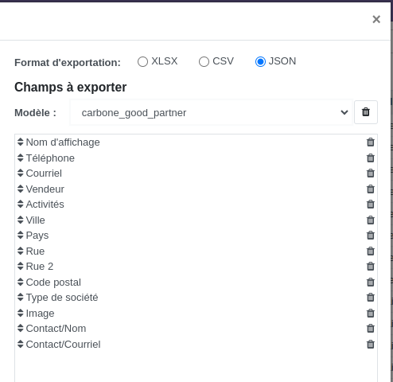

= Guide d'utilisation de l'export JSON

== Présentation de la fonctionnalité

L'export JSON permet, comme son nom l'indique, d'exporter les données d'un record en format JSON.

Ce type d'export peut être utilisé par exemple si le connecteur Carbone.io est utilisé, car il a besoin de recevoir les données à intégrer au document sous le format JSON.

== Utilisation de la fonctionnalité

- Dans l'interface Odoo, aller sur une vue Liste > sélectionner au moins un record :

- Ensuite, cliquer sur _Action_ -> _Exporter_ , cette action ouvre un popup :

- Sélectionner le format d'exportation de type _JSON_ , insérer tous les champs à exporter, créer un modèle d'export et le sauvegarder :

- Cliquer sur _Exporter_ , le fichier en format JSON est téléchargé.

== Autres

Des champs techniques nommés _tech_nom_du_champ_ seront automatiquement ajoutés pour chaque champ de type Selection. Ces entrées supplémentaires contiennent la clé python du champ.

Par exemple, pour un devis avec un champ Selection

`state = fields.Selection([('draft', 'Brouillon', 'sale', 'Bon de commande')])`

Exporter le champ `state` ajoutera automatiquement dans le JSON _tech_state : "draft"_

Cet ajout est effectivement uniquement si un champ _tech_nom_du_champ_ n'existe pas déjà pour le modèle dont on veut exporter les données.
Pour le moment, on log l'information.
